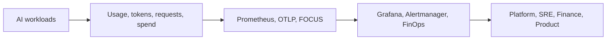

# XOps Labs

**Open-source infrastructure for AI-native reliability, observability, cost governance, and secure operations.**

We build small, sharp, self-hosted tools that help platform teams see, govern, and operate AI systems with the same confidence they expect from the rest of their cloud-native stack.

---

## What We Build

XOps Labs focuses on tools that make AI systems easier to operate in production:

| Area | What we care about |
|---|---|
| Observability | Metrics, dashboards, alerts, health signals, and operational feedback loops |
| AI FinOps | Cost visibility, showback, budget burn, provider spend, and model-level attribution |
| Platform operations | Kubernetes-ready, automation-friendly, self-hosted building blocks |
| Security and governance | Minimal permissions, inspectable code, open standards, and vendor-neutral workflows |

## Featured Project

### [llm-usage-exporter](https://github.com/xops-labs/llm-usage-exporter)

A self-hosted Prometheus exporter for LLM usage, token consumption, request volume, prompt caching, and USD cost telemetry across OpenAI, Azure OpenAI, Anthropic Claude, Google Gemini, and AWS Bedrock.

It gives platform, SRE, FinOps, and engineering teams a near-real-time AI cost signal inside Prometheus, Grafana, OpenTelemetry, Alertmanager, and FOCUS-compatible cost workflows.

## Operating Principles

- Open source by default
- Self-hosted and vendor-neutral
- Low-cardinality telemetry that can survive real Prometheus deployments
- OpenTelemetry and OpenMetrics friendly
- Built for cloud-native teams running Kubernetes, containers, and CI/CD
- Cost, reliability, and governance treated as the same operational problem

## Contributing

We welcome practical, production-minded contributions: provider integrations, dashboards, deployment examples, bug reports, docs, tests, and hard-earned operational feedback from real AI platforms.

Start here: [llm-usage-exporter contribution guide](https://github.com/xops-labs/llm-usage-exporter/blob/main/CONTRIBUTING.md)