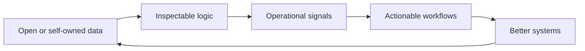

# XOps Labs

### Open-source systems for AI-native operations, secure infrastructure, and public-data intelligence

**XOps Labs builds self-hosted tools that turn opaque operational domains into inspectable, automatable systems: LLM usage and cost, post-quantum readiness, climate-risk screening, and live space/mission visibility.**

---

## What XOps Labs Builds

XOps Labs is an open-source lab for practical infrastructure and intelligence tools. The projects are intentionally different in domain, but they share the same operating shape: public or self-owned data in, transparent logic in the middle, useful operational signals out.

| Theme | Direction |
|---|---|
| **AI operations** | LLM usage telemetry, token and cost visibility, provider-level metrics, AI FinOps |
| **Secure operations** | Post-quantum cryptography discovery, crypto-agility scoring, SARIF CI gating |
| **Public-data intelligence** | Climate-risk screening, satellite and mission visibility, explainable data products |
| **Platform engineering** | Self-hosted services, Docker-first demos, OpenTelemetry, Prometheus, clean APIs |
| **Developer experience** | Clear docs, local-first workflows, honest roadmap boundaries, practical examples |

---

## Current Public Work

| Repository | What it does | Why it matters |
|---|---|---|
| **[llm-usage-exporter](https://github.com/xops-labs/llm-usage-exporter)** | Self-hosted Prometheus exporter for LLM usage, token volume, request counts, and USD cost telemetry across OpenAI, Azure OpenAI, Anthropic Claude, Google Gemini, and AWS Bedrock. | Makes AI spend and usage visible in the same observability stack teams already operate. |
| **[relixq-oss](https://github.com/xops-labs/relixq-oss)** | Open-source post-quantum cryptography scanner for source code, dependencies, TLS endpoints, and CI gating with SARIF. | Helps teams find quantum-vulnerable cryptography and build crypto-agility plans before migrations become urgent. |
| **[ClimateRiskIQ](https://github.com/xops-labs/ClimateRiskIQ)** | Self-hosted climate due-diligence screener for real estate, using public climate and hazard data with transparent 0-100 rules-based scoring. | Turns climate exposure from opaque property claims into an auditable first-pass screening report. |
| **[AstroTrack](https://github.com/xops-labs/AstroTrack)** | 3D satellite and mission tracker with SGP4 orbits, public CelesTrak data, NASA mission context, WebGL visualization, and pass prediction. | Makes orbital infrastructure visible and teachable for students, educators, hobbyists, and mission teams. |

---

## Shared Principles

- **Self-hosted before SaaS-dependent**: operators should be able to run the tool and inspect the data path.
- **Open standards over proprietary lock-in**: Prometheus, OpenTelemetry, SARIF, Docker, OpenAPI, TLE/SGP4, and public-data APIs where they fit.
- **Transparent logic over black boxes**: scoring, parsing, and reporting should be readable source code.
- **Low-friction local demos**: a useful project should be easy to clone, configure, and run.
- **Honest docs**: shipped means the code path exists, runs, and changes real output.
- **Production-minded defaults**: observability, security posture, and operational limits are part of the product, not polish after the fact.

---

## Explore By Need

| If you need... | Start here |
|---|---|
| LLM usage, cost, and provider telemetry | [llm-usage-exporter](https://github.com/xops-labs/llm-usage-exporter) |
| Post-quantum crypto inventory and CI evidence | [relixq-oss](https://github.com/xops-labs/relixq-oss) |
| Property climate-risk screening from public data | [ClimateRiskIQ](https://github.com/xops-labs/ClimateRiskIQ) |
| Satellite visibility, SGP4 propagation, and mission context | [AstroTrack](https://github.com/xops-labs/AstroTrack) |

---

## Get Involved

Bring issues, examples, integrations, dashboards, tests, docs, and real-world operational feedback. XOps Labs projects are built to become sharper when operators, builders, educators, and researchers push on them.

Explore the repositories: [github.com/xops-labs](https://github.com/xops-labs)
