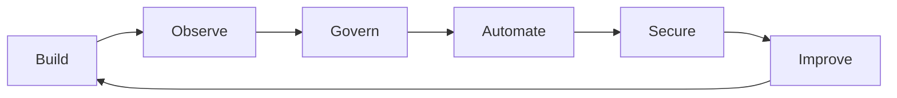

# XOps Labs

**Open-source systems for AI-native operations, observability, automation, security, and cost governance.**

XOps Labs is a place for practical infrastructure: tools that help teams run modern software and AI workloads with clearer signals, safer defaults, and less operational guesswork.

---

## What XOps Labs Works On

XOps Labs is not a single-project org. It is an open-source lab for tools that sit close to production operations: the layer where platform engineering, observability, security, FinOps, and AI systems all start to overlap.

| Workstream | Direction |
|---|---|
| AI-native operations | LLMOps, model usage visibility, provider telemetry, agent-aware infrastructure |
| Observability | Prometheus metrics, Grafana dashboards, OpenTelemetry, health signals, alert-ready data |
| FinOps and governance | Cost attribution, budget signals, FOCUS-style records, showback and chargeback workflows |
| Platform automation | Kubernetes, containers, CI/CD, release workflows, deployment scaffolding, day-2 operations |
| Security operations | Least privilege, secret-safe patterns, CodeQL, supply-chain metadata, secure defaults |
| Developer experience | Practical docs, local-first demos, repeatable examples, boringly useful tooling |

## Current Public Work

### [llm-usage-exporter](https://github.com/xops-labs/llm-usage-exporter)

A self-hosted Prometheus and OpenTelemetry exporter for LLM usage, token volume, request counts, prompt caching, and cost telemetry across major AI providers.

It shows the XOps Labs observability pattern: make invisible AI usage signals visible, keep telemetry self-hosted, and give teams data they can actually act on.

### [relixq-oss](https://github.com/xops-labs/relixq-oss)

An open-source Post-Quantum Cryptography scanner that inventories quantum-vulnerable cryptography across source code, dependencies, TLS endpoints, certificates, and configs.

Relix-Q scores risk, grades crypto-agility, exports SARIF for CI gating, and keeps scans self-hosted so code stays on the operator's machine.

These projects follow the same pattern: focused tools, open standards, production-minded defaults, and clear docs.

## Operating Principles

- Open source by default
- Self-hosted before SaaS-dependent
- Open standards over proprietary lock-in
- Low-cardinality, production-safe telemetry
- Security and cost treated as operational concerns, not afterthoughts
- Tools should be easy to run locally and credible in production

## Get Involved

Bring issues, ideas, provider integrations, dashboards, examples, docs, tests, and real-world operational feedback. XOps Labs is built around practical tools that become sharper when operators use them.

Explore the repositories: [github.com/xops-labs](https://github.com/xops-labs)
